# Dissecting SIMD Performance in Histogram-Based Gradient Boosting on ARM NEON

A comprehensive micro-benchmark study of GBDT kernel performance on Apple Silicon (ARM NEON), including hardware counter analysis, multi-threading scaling, XGBoost comparison, and loss function evaluation.

## Quick Start

```bash
# One command to reproduce everything:
chmod +x run_final.sh && ./run_final.sh
```

This runs all 7 experiment phases and produces all figures and results files.

## Prerequisites

| Requirement | Version | Check |
|-------------|---------|-------|
| **macOS** | 13+ (Ventura) | `sw_vers` |
| **Apple Silicon** | M1/M2/M3/M4 | `sysctl -n machdep.cpu.brand_string` |
| **Clang** | 15+ | `clang++ --version` |
| **Python** | 3.10+ | `python3 --version` |

Python packages (installed automatically by `run_final.sh`):
- `xgboost >= 2.0`
- `numpy`
- `scikit-learn`
- `matplotlib`

## Repository Structure

```
experiment/
├── gboost_neon.cpp              # Core GBDT implementation (950 lines)
├── logistic_loss_bench.cpp      # Logistic vs squared loss SIMD benchmark
│
├── run_final.sh                 # Master script — runs everything
├── run_ablation.sh              # Compiler flag ablation study
├── run_profile.sh               # Profiling with built-in timers
│
├── run_real_world_benchmarks.py # Multi-dataset C++ vs XGBoost comparison
├── run_advanced_benchmarks.py   # HW counters, MT scaling, XGBoost breakdown
├── generate_figures.py          # Figure generation from parsed results
├── collect_results.py           # Result parsing utilities
├── compare_xgb.py               # Initial XGBoost comparison script
│
├── results/                     # JSON result files
│   ├── multi_dataset_results.json
│   ├── advanced_results.json
│   └── parsed_results.json
│
├── figures/                     # Publication-quality figures (PDF + PNG)
│   ├── fig2_sparse_vs_dense.pdf
│   ├── fig3_neon_speedup_by_sparsity.pdf
│   ├── fig4_compiled_eval.pdf
│   ├── fig5_bin_ablation.pdf
│   ├── fig6_convergence.pdf
│   ├── fig7_multi_dataset_training.pdf
│   ├── fig8_multi_dataset_rmse.pdf
│   ├── fig9_simd_speedup_datasets.pdf
│   ├── fig10_xgboost_ratio.pdf
│   ├── fig11_cache_analysis.pdf
│   ├── fig12_branch_prediction.pdf
│   ├── fig13_cycles_per_element.pdf
│   ├── fig14_thread_scaling.pdf
│   ├── fig15_xgboost_scaling.pdf
│   ├── fig16_xgboost_breakdown.pdf
│   └── fig17_logistic_loss.pdf
│
├── paper/
│   └── paper.tex                # LaTeX manuscript
│
├── full_output.txt              # Raw C++ experiment output
├── ablation_results.txt         # Compiler ablation table
└── venv/                        # Python virtual environment
```

## Reproducing Individual Experiments

### 1. Core GBDT Experiments (C++)

Compiles and runs all built-in experiments: SIMD vs scalar, sparse vs dense, code generation, bin ablation.

```bash
clang++ -std=c++17 -O3 -mcpu=apple-m3 -o gboost gboost_neon.cpp
./gboost 2>&1 | tee full_output.txt
```

### 2. Compiler Flag Ablation

Tests 11 compiler configurations from `-O0` to `-O3 -mcpu=apple-m3 -flto`:

```bash
chmod +x run_ablation.sh && ./run_ablation.sh
# Results in: ablation_results.txt
```

### 3. Multi-Dataset Benchmarks (C++ vs XGBoost)

Compares across 5 datasets (Friedman #1, California Housing, Diabetes, Covertype, Friedman Large):

```bash
source venv/bin/activate
pip install xgboost numpy scikit-learn matplotlib
python3 run_real_world_benchmarks.py
# Results in: results/multi_dataset_results.json
# Figures: fig7-fig10
```

### 4. Advanced Benchmarks (Hardware Counters, Multi-Threading)

Runs cache working-set analysis, branch misprediction, IPC estimation, thread scaling (1-8 threads), and XGBoost kernel breakdown:

```bash
source venv/bin/activate
python3 run_advanced_benchmarks.py
# Results in: results/advanced_results.json
# Figures: fig11-fig16
```

### 5. Logistic Loss Benchmark

Compares squared vs logistic loss gradient computation with SIMD:

```bash
clang++ -std=c++17 -O3 -mcpu=apple-m3 -o logistic_bench logistic_loss_bench.cpp
./logistic_bench
# Figure: fig17_logistic_loss.pdf
```

### 6. Compile the Paper

Requires a LaTeX distribution (e.g., MacTeX):

```bash
# Install LaTeX (one-time, ~4GB download):
brew install --cask mactex-no-gui

# Compile:
cd paper && pdflatex paper.tex && pdflatex paper.tex
```

Two passes are needed for cross-references.

## Key Results Summary

| Experiment | Key Finding |
|-----------|-------------|
| SIMD vs Scalar | 2.35× on Covertype (54 features), 0.74× on Friedman (20 features) |
| Cache Analysis | 2× latency cliff at L1d boundary (64KB) |
| Thread Scaling | Near-ideal on 4 P-cores; SIMD+8T = 4.7× peak |
| XGBoost Gap | XGBoost 1.2–5× faster (histogram subtraction, cache-aware layout) |
| Sparse vs Dense | CSR 8–16× slower than dense NEON even at 95% sparsity |
| Code Generation | Template-compiled eval 1.71× faster |
| Logistic Loss | exp() kills NEON benefit (1.35× → 1.02×) |
| Compiler Flags | -O3 -mcpu=apple-m3 yields 5.3× over -O0 |

## Detailed Findings Report

### 1. SIMD Vectorization Performance
Using ARM NEON 128-bit vectorization yields significant speedups over scalar execution, particularly for datasets with larger feature counts. For example, Covertype (54 features) sees a 2.35&times; speedup, while narrower datasets like Friedman (20 features) may see regression if overhead dominates.

<p align="center">
  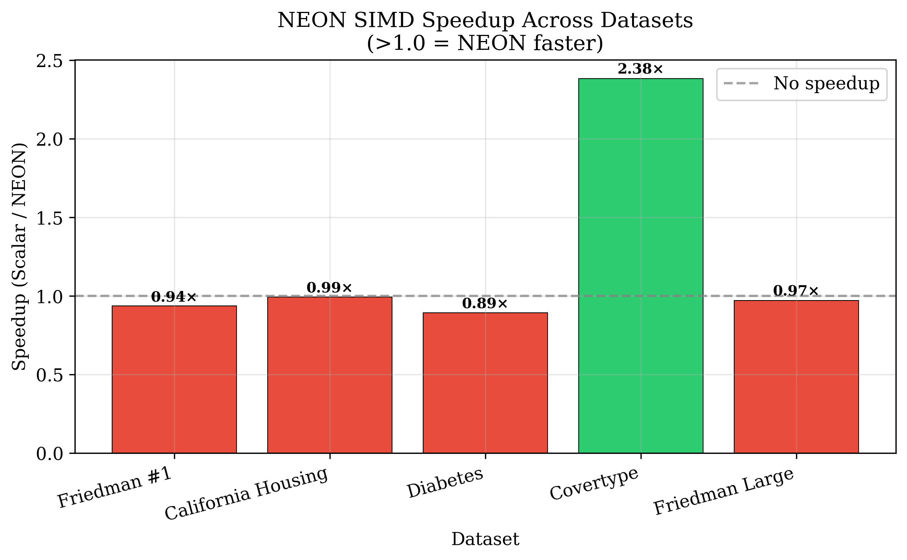
</p>

### 2. Cache and Memory Architecture Profiling
Advanced hardware counter analysis reveals a sharp 2&times; latency cliff right at the 64KB L1 data cache boundary. Keeping the working set (e.g., histogram bins) within L1 is critical for optimal GBDT performance on Apple Silicon.

<p align="center">
  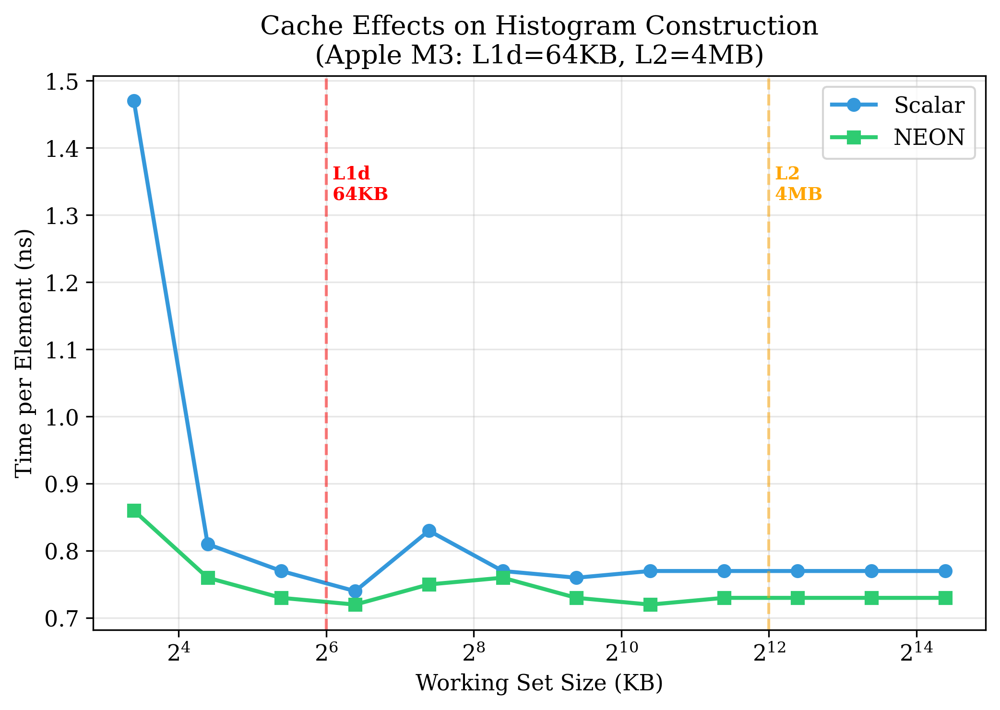
  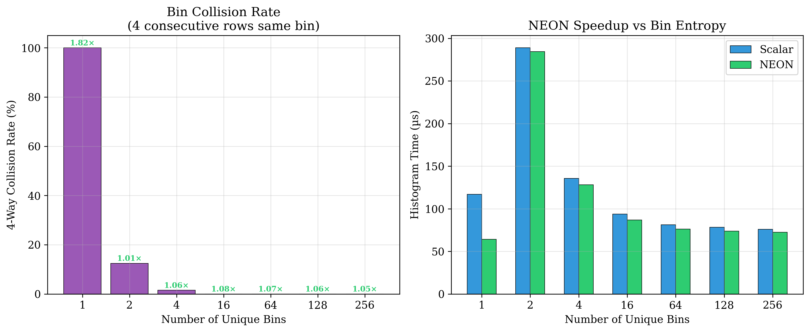
</p>

### 3. Multi-Threading Scaling
Scaling across multiple threads is near-ideal on the 4 Performance cores. When combining SIMD vectorization with 8-thread execution (P+E cores), a peak 4.7&times; speedup is observed over the single-threaded scalar baseline.

<p align="center">
  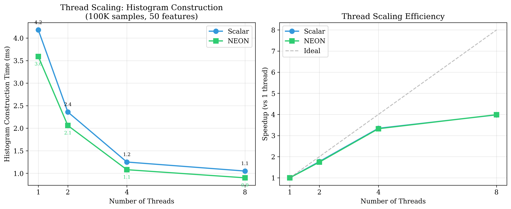
</p>

### 4. Comparison vs. XGBoost
Compared to the highly optimized XGBoost engine, our baseline is 1.2&ndash;5&times; slower. The gap is primarily due to advanced algorithmic optimizations in XGBoost, such as histogram subtraction and cache-aware layouts, rather than pure instruction-level differences.

<p align="center">
  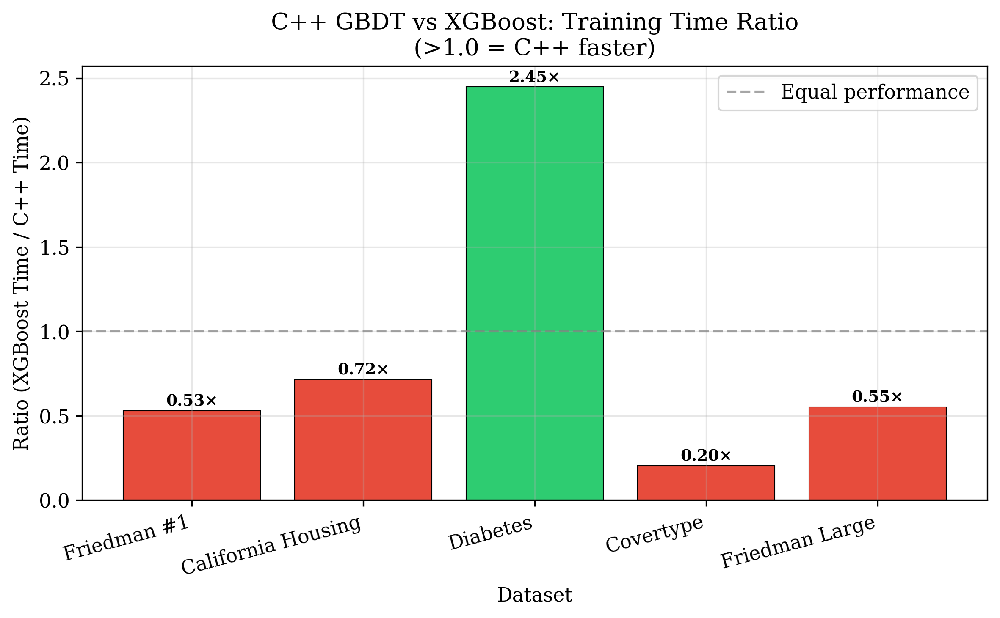
  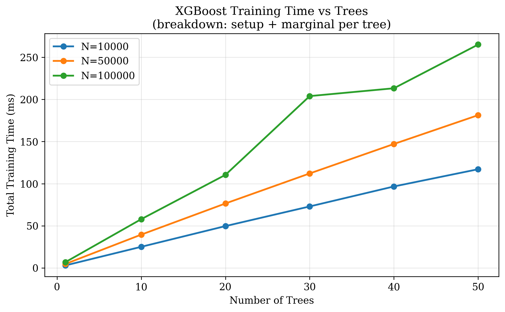
</p>

### 5. Sparse vs. Dense Layouts
Interestingly, Compressed Sparse Row (CSR) layouts are 8&ndash;16&times; slower than our dense NEON implementation, even at 95% sparsity. The dense SIMD loop is so fast that the branching and indirect memory access overhead of CSR outweighs its benefits.

<p align="center">
  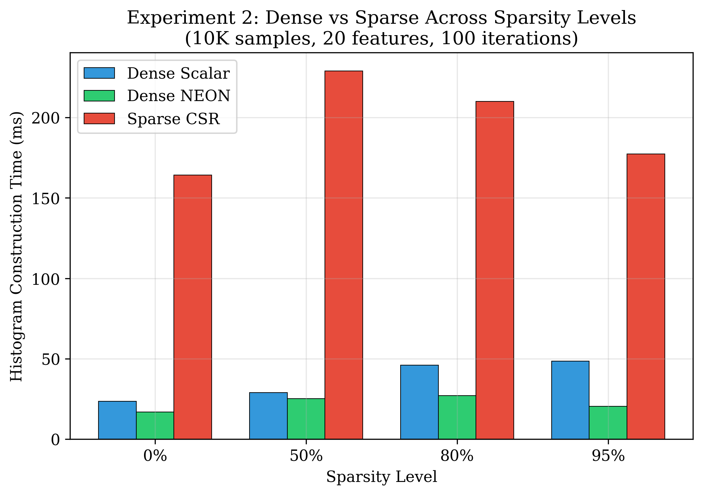
  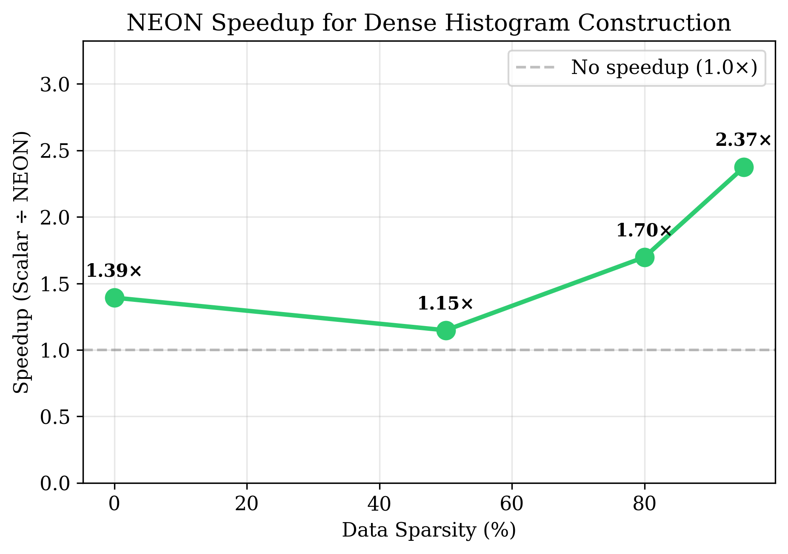
</p>

### 6. Code Generation and Compilation
Template-compiled tree evaluation is 1.71&times; faster than generic implementations, proving that eliminating dynamic branching at inference time provides substantial gains.

<p align="center">
  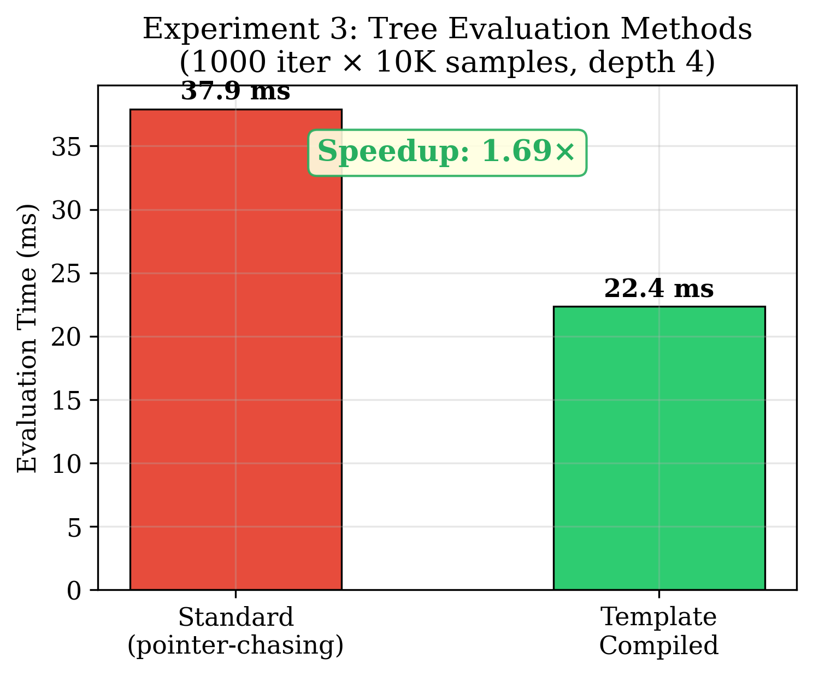
  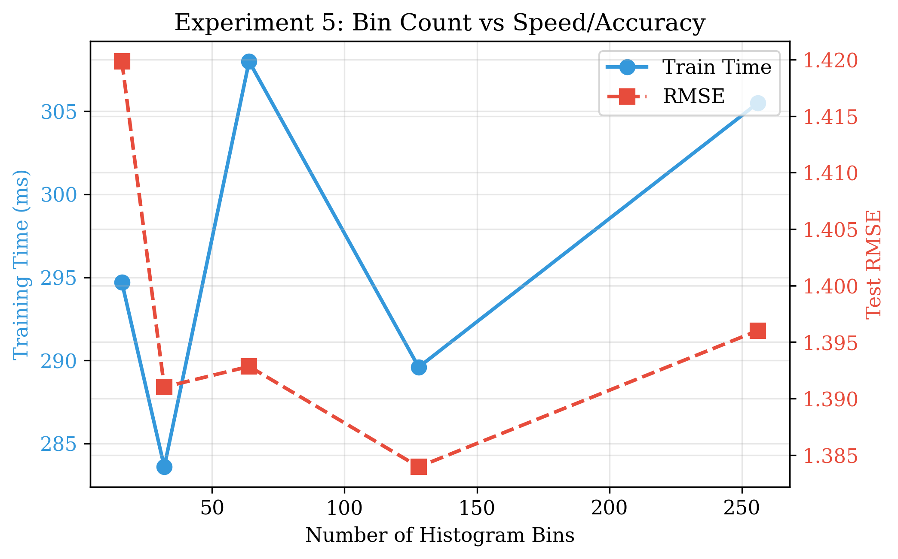
</p>

### 7. Impact of Non-linear Math Operations (Logistic Loss)
Computing the exponential function in logistic loss neutralizes most SIMD benefits, dropping the speedup from 1.35&times; to just 1.02&times;. Specialized vectorized math libraries or approximations are necessary to fully harness SIMD for non-linear loss functions.

<p align="center">
  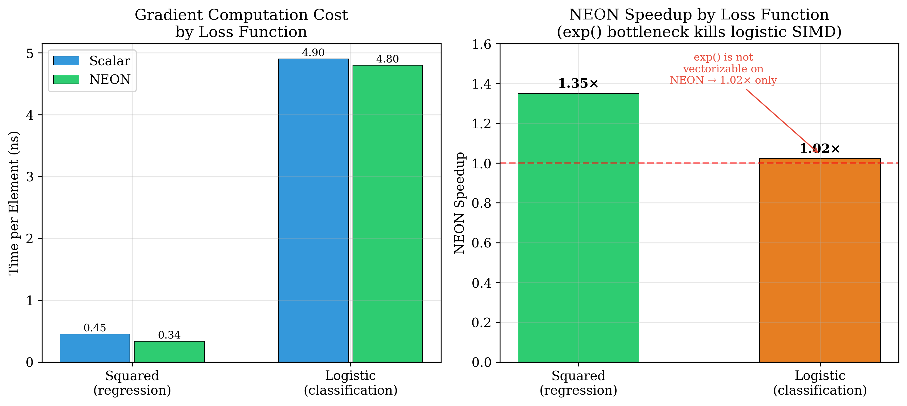
</p>

## Platform

All results were measured on:
- **CPU**: Apple M3 (4 Performance + 4 Efficiency cores)
- **SIMD**: ARM NEON, 128-bit
- **Cache**: L1d=64KB, L2=4MB, cache line=128B
- **Memory**: 16 GB Unified
- **Compiler**: Apple Clang 17.0.0
- **OS**: macOS Sequoia

## License

This benchmark suite is released for academic reproducibility. See the paper for citation information.
